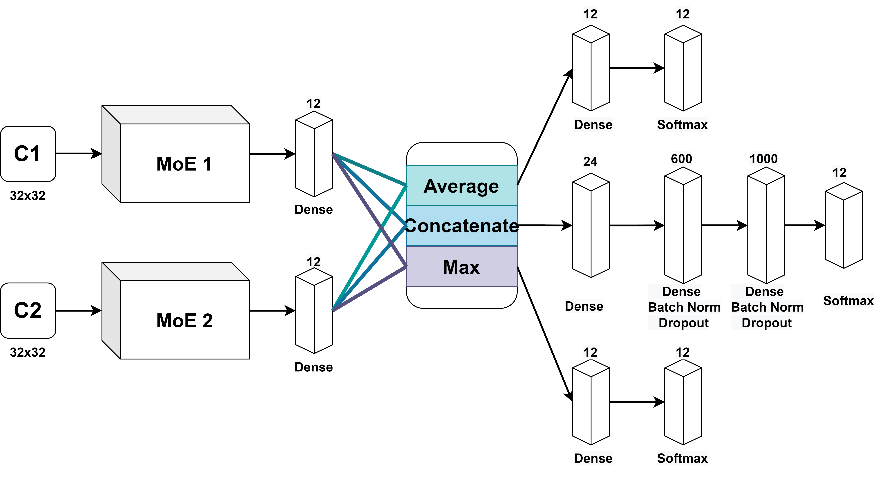
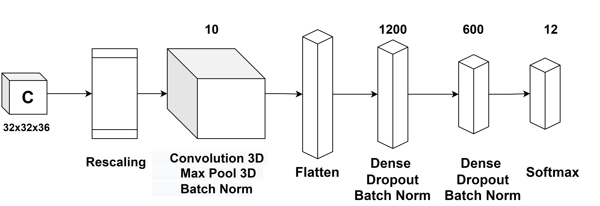
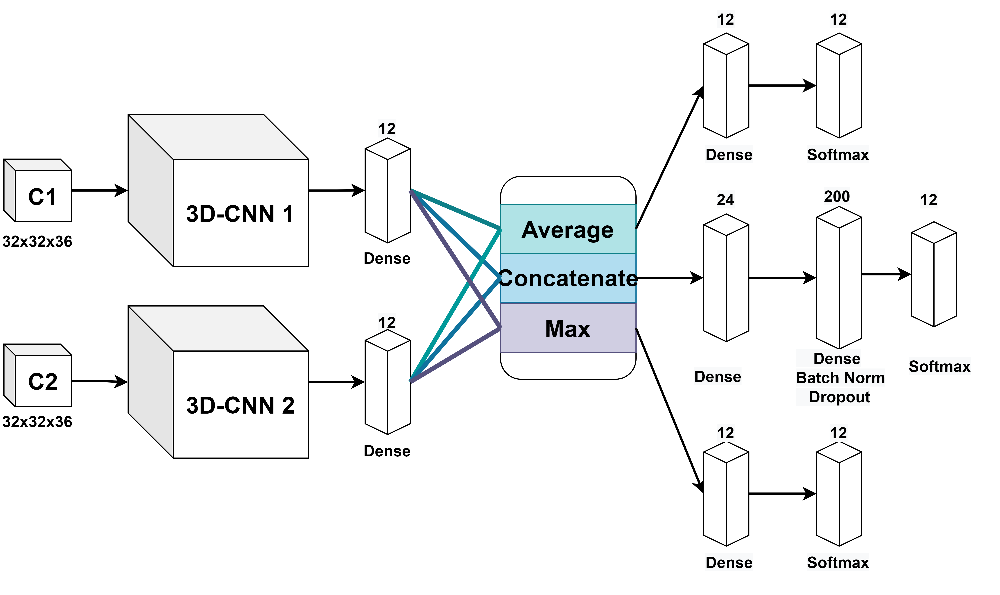

# Fall Detection Using Mixtures of Convolutional Neural Networks 
In this project, I will carry out a further work that have been proposed in [previous project](https://github.com/hoangNguyen210/Fall-Detection-Project-/blob/main/README.md) mainly for camera dataset (C1 and C2).
## System requirement 
- numpy - version 1.21.5
- pandas - version 1.3.5
- cv2 -version 4.1.2
- sklearn -version 1.0.2
- tensorflow - version 2.8.0
- keras - version 2.8.0

## Implementation Description 
There are 2 main folders : **model** and **data_preparation**:
- Folder **data_preparation** contain our code to process dataset in this project. 
- Folder **model** include our proposed method for this dataset. 
1. [**data_preparation**](https://github.com/hoangNguyen210/Fall-Detection-Research-2/tree/main/data_preparation) : 
  - [load_raw.ipynb](https://github.com/hoangNguyen210/Fall-Detection-Research-2/blob/main/data_preparation/load_raw.ipynb) : This file loads raw dataset of UP-FALL detection dataset.
  - [load_background.ipynb](https://github.com/hoangNguyen210/Fall-Detection-Research-2/blob/main/data_preparation/load_background.ipynb) : This file extracts foreground and background from UP-FALL Detection dataset using MOD-NET model. These foreground dataset will be use as a part of augmentating our training set.
  - [load_clip.ipynb](https://github.com/hoangNguyen210/Fall-Detection-Research-2/blob/main/data_preparation/load_clip.ipynb) : This file creates video frame dataset by combining images with ascending timestamp order. 
2. [**model**](https://github.com/hoangNguyen210/Fall-Detection-Research-2/tree/main/model) :
  - [Raw_data.ipynb](https://github.com/hoangNguyen210/Fall-Detection-Research-2/blob/main/model/Raw_data.ipynb) : This file uses our proposed method for raw dataset.
  - [Augment_data.ipynb](https://github.com/hoangNguyen210/Fall-Detection-Research-2/blob/main/model/Raw_data.ipynb) : This file uses our proposed method for augmentating dataset.
  - [3D-data.ipynb](https://github.com/hoangNguyen210/Fall-Detection-Research-2/blob/main/model/3D_data.ipynb) : This file uses our proposed method for video frame dataset.
## Dataset :
  - You can access our loading dataset in this [link](https://drive.google.com/drive/folders/1J0ufMF8Utao2hz1rVr6X8RDLCc6psjcX?usp=sharing)

## Pretrained model :
 - Here is some of our pretrained weight after training these dataset, you can examine it in this [link](https://drive.google.com/drive/folders/1NLDSV2Sf7zJN_H6LlxXY2B-nO4WC1OVl?usp=sharing)

**Here is the short form of our paper.** 
## Table of Contents
<!-- * [Acknowledgements](#acknowledgements) -->
* [Introduction](#introduction)
* [General Info](#general-information)
* [Dataset description](#dataset-description)
* [Data preprocessing](#d-p)
* [Proposed method](#proposed-method)
* [Result](#result)
* [Conclusion and Furture Work](#cc)
* [Room for Improvement](#room-for-improvement)
* [Contact](#contact)

## Introduction

## General Information

## Dataset description
- You can download UP-Fall Detection dataset in this [link](https://sites.google.com/up.edu.mx/har-up/) . This dataset includes over 850 GB of data from wearable sensors, ambient sensors, and vision equipment. 17 young healthy people with age ranging from 18–24 years old were invited to perform 11 different activities. Here is the summary of activities. 

| Activity ID | Description  | Duration (s)  |
| :-----:     | :-:          | :-:           |
|     1        | Falling forward using hands          | 10           |
| 2     | Falling forward using knees          | 10           |
| 3    | Falling backwards         | 10           |
| 4     | Falling sideward          | 10           |
| 5     | Falling sitting in empty chair         | 10           |
| 6     | Walking          | 60           |
| 7     | Standing         | 60           |
| 8     | Sitting          | 60           |
| 9     | Picking up an object         | 10           |
| 10     | Jumping          | 30           |
| 11     | Laying          | 60           |

||
|:--:| 
| *Location of measurement devices* |
You can read more about this dataset at this [paper](https://www.mdpi.com/1424-8220/19/9/1988).

## Data preprocessing :

## Proposed methods :

### Mixture of Experts : 
||
|:--:| 
| *Mixture of Experts models for C1 dataset (MoE-1)* |

||
|:--:| 
| *Mixture of Experts models for C2 dataset (MoE-2)* |

||
|:--:| 
| *Mixture of Experts models for C1 and C2 dataset (M-MoE, C-MoE, A-MoE)* |

### Data Augmentation :

### 3D-CNN : 

||
|:--:| 
| *3D CNN for C1 and C2 dataset (3DCNN-1, 3DCNN-2)* |

||
|:--:| 
| *Combining 3D-CNN models for each dataset (A-3DCNN, M-3DCNN, C-3DCNN)* |

## Result 
<!-- | Data | Model  | Accuracy  | Precision | Recall | F1-Score |
|---------------|-----------|-----------|--------|----------|
| S | XGBoost   CatBoost   MLP  |  | 99.21   99.05   99.04   | 99.19   99.02   99.05   | 99.21   99.05   99.03  | 99.20   99.02   99.03   | -->

- Performance of our proposed method for each dataset :

| Data | Model  | Accuracy  | Precision | Recall | F1-Score | Pretrained  |
| :-----:     | :-:          | :-:           |  :-:           |  :-:           |  :-:        |  :-:           |
|     **C1**  | MoE-1   MoE-1 + DA   3DCNN-1   | 99.48   99.50      99.38       | 99.47   99.49    99.38           | 99.48   99.50   99.38   |99.47  99.49   99.38   |  [download](https://drive.google.com/file/d/1nn3SIFsueHTuexRtRS7RVV2A8XEnT7wi/view?usp=sharing)           [download](https://drive.google.com/file/d/1XwyyF0nhCNACQK8HowcLpfvdNsc2S18c/view?usp=sharing)     [download](https://drive.google.com/file/d/1K3eA7NFmWgHV9CgrPxRdSMvnum0aewTj/view?usp=sharing)           |
| **C2**  | MoE-2   MoE-2 + DA   3DCNN-2   | 99.59   99.61      99.41       | 99.59   99.61    99.41           | 99.59   99.61   99.41   |99.59  99.61   99.41   | [download](https://drive.google.com/file/d/11PGkrvQMVpl93u0PQ0vopK3WI2dIJ55s/view?usp=sharing)           [download](https://drive.google.com/file/d/1WTGW9Vtdh5NFFzVbm9Z7Y56EjxBqhR2L/view?usp=sharing)     [download](https://drive.google.com/file/d/1mdAEWfdMuJbjib6MxKefRW_K-C6V_FuK/view?usp=sharing)           |
| **C12**  | C-MoE   M-MoE   A-MoE   C-MoE + DA   A-MoE + DA   M-MoE + DA   C-3DCNN   M-3DCNN   A-3DCNN  | 99.62   99.64   99.66   99.62   **99.67**   99.66   99.44   99.43   99.49| 99.62   99.64   99.66   99.62   **99.67**   99.66   99.44   99.42   99.49 | 99.62   99.64   99.66   99.62   **99.67**   99.66   99.44   99.43   99.49 |99.62   99.64   99.66   99.62   **99.67**   99.66   99.44   99.42   99.49  |  [download](https://drive.google.com/file/d/1-6A3dQhE5DkGY_fsym22JTZBd07i5rAd/view?usp=sharing)   [download](https://drive.google.com/file/d/1-4sPl-YEVbJI8B6ivumDh-pHgI-kK3cK/view?usp=sharing)   [download](https://drive.google.com/file/d/16waFreS79wUYpKtW14TNQoDulqBy8dEg/view?usp=sharing)   [download](https://drive.google.com/file/d/1-3jUgUm5tSwlALD8iyk5kBpwGknFVLyR/view?usp=sharing)   [download](https://drive.google.com/file/d/1S1AqLYSIqX3feNyvzpLwHrh4ssu6pD9p/view?usp=sharing)    [download](https://drive.google.com/file/d/1abYxcpsIf3XlR01IP8Hdm2TjFGkj445l/view?usp=sharing)   [download](https://drive.google.com/file/d/1-6A3dQhE5DkGY_fsym22JTZBd07i5rAd/view?usp=sharing)   [download](https://drive.google.com/file/d/1-4sPl-YEVbJI8B6ivumDh-pHgI-kK3cK/view?usp=sharing)   [download](https://drive.google.com/file/d/16waFreS79wUYpKtW14TNQoDulqBy8dEg/view?usp=sharing) |   

- Comparing with recent work :

| Data | Name | Model  | Acc | WPre | WRec | WF1 |
| :-----:     | :-:          | :-:           |  :-:           |  :-:           |  :-:           | :-: |
|     **C1**  | [Martinez et al.](https://www.mdpi.com/1424-8220/19/9/1988)   [Espinosa et al.](https://sci-hub.se/10.1016/j.compbiomed.2019.103520)   [Chahyati et al.](https://sci-hub.se/10.1109/icacsis51025.2020.9263201)  [Ramirez et al.](https://sci-hub.se/10.1109/access.2021.3061626)   [Research 1](https://github.com/hoangNguyen210/Fall-Detection-Project-1)      **Ours**   | 2D-CNN   2D-CNN   2D-CNN   Random Forest   2D-CNN   MoE-1 + DA     | 78.49   98.06    88.25    99.45   99.17   **99.49**   |74.92   97.94    85.22   96.60   99.24   **99.48**     | 78.49   98.06   88.25   89.99   99.12   **99.49** | 76.33   97.88   86.57   92.34   99.16   **99.48** |
|     **C2**  | [Martinez et al.](https://www.mdpi.com/1424-8220/19/9/1988)   [Espinosa et al.](https://sci-hub.se/10.1016/j.compbiomed.2019.103520)   [Chahyati et al.](https://sci-hub.se/10.1109/icacsis51025.2020.9263201)  [Research 1](https://github.com/hoangNguyen210/Fall-Detection-Project-1)      **Ours**   | 2D-CNN   2D-CNN   2D-CNN   2D-CNN   MoE-2 + DA     | 87.93   97.58    88.35    99.39   **99.61**    | 84.7   96.96    85.06    99.40   **99.60**     | 87.93   97.58    88.35    99.39   **99.61**  | 85.69   97.19   86.36   9.40   **99.60** |
|     **C12**  | [Espinosa et al.](https://sci-hub.se/10.1016/j.compbiomed.2019.103520)    [Espinosa et al.](https://sci-hub.se/10.1016/j.compbiomed.2019.103520)   [Research 1](https://github.com/hoangNguyen210/Fall-Detection-Project-1)    **Ours**   | Concatenate 2D-CNN   Concatenate VGG-16   Concatenate 2D-CNN   A-MoE + DA   | 98.81   27.86    99.46    **99.67**  |98.81   7.76    99.47    **99.67**  | 98.81   27.86    99.46    **99.67**  | 98.78   12.14    99.46    **99.67**  |

## Conclusion and Future Work 

<!-- ## Acknowledgements
- This project was also a part of my **Graduate Thesis** in my final year at university.
- This project was inspired by 2 of my teachers at HCMUS: Thao. V Ha and Binh Nguyen.
- My main responsibilities in this project were implementing code, visualizating our methods as well as results, and writing a paper.
- Our teacher helped me correct my writing mistakes and submitted the paper.

## Project Status
Project is: **_in progress_**. Our goal is to submit to **ISI Q2 Journal**( or Q1 if possible). I have finished our experiment proccess (implement code and visualize result) and currently I am  writting a paper. Other authors help me to revise code as well as check grammar mistakes in our paper. 
 -->

## Contact
- Nguyen Thanh Binh  (University of Science Ho Chi Minh city, ngtbinh@hcmus.edu.vn)
- Nguyen Minh Hoang (University of Science Ho Chi Minh city, hoangng210a@gmail.com)

## References
<pre><code> @misc{ung2021efficient,
      title={An Effective Leaf Recognition Using  Convolutional Neural Networks Based  Features}, 
      author={Hoang M. Nguyen and Thao V. Ha and Son H. Thanh and Binh T. Nguyen},
      year={2022},
      eprint={},
      archivePrefix={arXiv},
      primaryClass={cs.CV}
}</code></pre>

